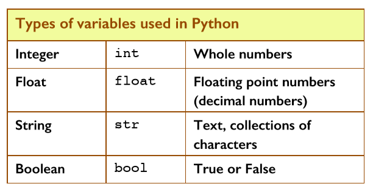
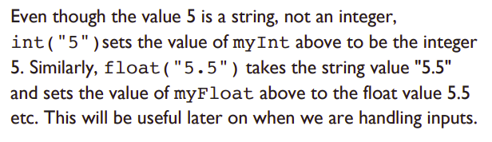

# Variable Types



# OneNote
> Chapter 1 - Variables & Data Types


  ## Challenges from Book (p14 - 15)
Here is a program for assigning four variables, using 
assignment statements:
````python
x = 5
y = 3.14
z = "Pi"
k = True
````

This example uses each of the four types of Python variable.
We can also print out the variable’s type using Python’s
function ``type(variable)``. This allows you to find out 
which type Python has chosen for your variable. 

1. Add these lines to the program above
````python
print(type(x))
print(type(y))
print(type(z))
print(type(k))
````
Before running your program, *PREDICT* what the output will be and write it into your copy.

## Integers and Floats
- Examples of integers include: ``2, 606, -3, 0`` etc.
- Examples of floats include: ``0.6, -9.55, 35.02`` etc

2. Type this program beneath the previous example and run it in ``main.py``:
````python
x= 5
print(type(x))
x = 5.1
print(type(x))
````

NOTE: We did not have to tell Python that variable x (initially a type int) needed to be changed to type float. Python detected this itself and made the change.

## Casting

3. Converting a variable value to a float.

Type this program into ``main.py`` to convert a variable to a float:
````python
x = float(5)
print(type(x))
print(x)
x = 5.1
print(type(x))
print(x)
````
Add comments to each line of code to *PREDICT* what each line will output. Run the code to check your answers.

4. Converting from type ``float`` to ``int``.

Amend the program to read like this:
````python
x = float(5)
print(type(x))
x = int(5.1)
print(type(x))
````
Again add comments to describe what each line is doing.

5. Add another line to the program above to display the value of variable x on the screen using ``print(x)`` as the fifth line. What do you think its value will be? Why?
>

6. We can convert any Python variable:
````python
# Code Block A
myInt = int("5")
myFloat = float("5.5")
myString = str(5)
myBool = bool("False")
````


Add the following code to to ``Code Block A`` to display the variable types:
````python
# Code Block B
print(type(myInt))
print(type(myFloat))
print(type(myString))
print(type(myBool))
````
Finally add some code to display the output of the variables

````python
# You need to figure this out yourself...
print()
````
>

7. Printing variables with descriptive text *(a string)*.
   
Suppose we want to print three variables with some descriptive text.

Try this method in ``main.py``:
````python
x = 5
y = 7
z = 9
print("The answer is: ", x, y, z)
````
  