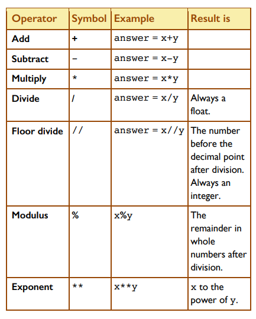
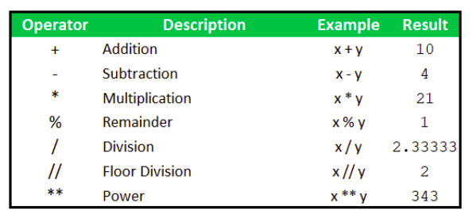

# Arithmetic Operators

Python uses certain symbols for carrying out calculations on numbers. We refer to these calculations as arithmetic operations, for example multiplication. 

These operations are carried out on the numerical variable types, i.e. integer ``int`` and float``float``.

The following table shows the basic operator symbols that Python uses for arithmetic operations.




## Operations
The table below illustrates how these operators are carried out. Assume that the number in each case are ``x = 7`` and  ``y = 3``.




See if you can work out the calculations in your head, and then check your answer with those shown in the table above.

# Task
Type up the code in the example above and run your first set of Python Operations in ``main.py``. Check your predictions with the output answers.

````python
# Define values for x and y
x = 7
y = 3

# Operations
addition = x + y
subtraction = x - y

````
