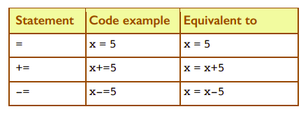

# More Practice withg Operators

These examples are taken from your textbook on pages 15-17.

## PRIMM
In each of the following, use code tracing to *PREDICT* what the output will be in each case. 

Only then should you run the code in ``main.py``

````python
# Task 1
x = 5
y = 7
z = 9
print("The answer is: ", x, y, z)
````

````python
# Task 2
x = 5
x = x+2
print(x)
````
## Incrementing
The code ``x = x+1`` is often needed in programming. 

It is used to increment a number, (i.e. to increase a number by a certain amount, in this case by one.) 

Python provides another way of doing this: 
``x+=1``

In fact, Python provides alternatives for various different 
kinds of *incrementing* and *decrementing* (decreasing by a 
certain amount). These are summarised as follows.




## PRIMM
In each of the following, use code tracing to *PREDICT* what the output will be in each case. 

Only then should you run the code in ``main.py``

Add ``#comments`` to describe what your code is doing and to identify the type of operator being used.

### Task 3
````python
### Task 3
# What does this code do?
x = 5
x += 1
print(x) 

# What does this code do?
y = 7
y -= 2
print(y)

# What does this code do?
print(x * y) 
````
### Task 4
````python
### Task 4
# What does this code do?
x = 2
x *= 5
print(x) 

# What does this code do?
y = 24
y /= 12
print(y)

# What does this code do?
a = 36
b = 5
print(a // b) 
````
### Task 5

````python
### Task 5
# What does this code do?
x = 25
y = 5
z = x / y
print(z) 
print(type(z))

# What does this code do?
a = 25
b = 12
c = a // b
print(c)

# What does this code do?
a = 25
b = 12
c = a % b
print(c)

# What does this code do?
x = 2
y = 3
print(x ** y) 
````


  