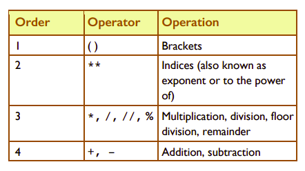
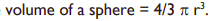

# BIMDAS
### Brackets - Indices - Multiply - Divide - Add - Subtract 


In Python, the order of operations (also called order of precedence) is similar to the order of operations that you use in maths. 

This is shown in the table below.




  ## Steps
  1. Try *Example A* & *Example B* from p16 of your book.
  2. Code it up in ``main.py`` and see what happens

 >

## Volume of a Sphere
Let’s find the volume of a sphere with a radius ``r`` of 7 units, 
assuming ``pi`` is ``3.14``. 
Use the formula below:


We will use variables to store data.
Complete the following code in ``main.py``
````python
# Calculate the Volume of a Sphere
pi = 
r = 

volumeOfSphere = 

print()

````
## Rounding
Suppose the answer was in monetary units, for example an insurance quote. A customer would not want to see so many digits displayed after the decimal point. In this case, we should round it to two decimal places. 

Python’s ``round()`` function allows us to do this easily.

- Add the follwing line of code into the right location to get a new answer for Volume with 2 decimal places.
````python
answer = round(answer, 2)
````

 >
