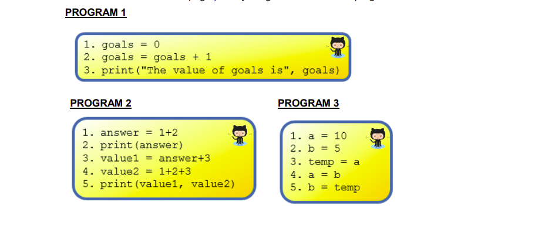
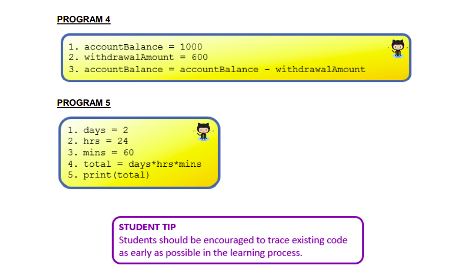

# Program Tracing  

  ## PRIMM Activity 
  1. Manually trace the programs shown above in your copy.
  2. After you have predicted each one, then code up the program in ``main.py`` and include necessary comments to explain what your code is doing.

  