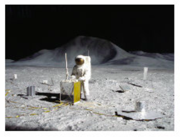

# Task 7 - Weight on the Moon  


 
Prompt the user to input their mass in kg & then create a program that will calculate their weight on the Moon.


 

  ## Steps
  1. Create a user prompt to get their mass in kg.
  2. Convert their mass in kg to weight in Newtons, output their weight on the Earth in Newtons.
``weight = mass * 9.8``
  3. Calculate their weight on the Moon.
````
HINT: The weight of an object on the Moon is 16.5% of what it is on Earth.
````
  4. Output their weight on the moon as part of the following sentence:
````python
print("Your weight on the Moon is _____ Newtons.")
````

  