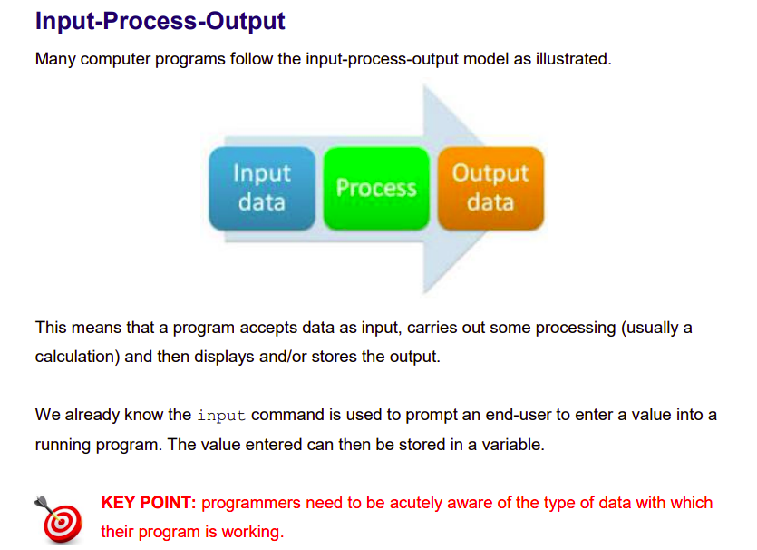
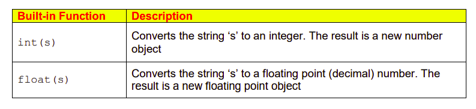

# Input - Process - Output



By default, the `input` command returns a string. This means that if you want your program to accept numeric data from the end-user, the value entered must be converted from a string 
to either an integer or a floating point (i.e. a decimal) number.




  ## Challenge
1. We want to write a program to calculate a person’s year of birth. Our program will ask the end-user for two pieces of information - the current year and the age they will be at the end of the current year.
2. We will store this data in two variables –> `year` and `age`. 
3. Since `year` and `age` are both numeric we will need to instruct the program to convert them from strings to integers. This can be done with the `int` command.

Below are some sample prompts you could use...

````py
"Enter the current year: "

"What age will you be at the end of this year: "

"You were born in", year - age
````
  