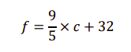
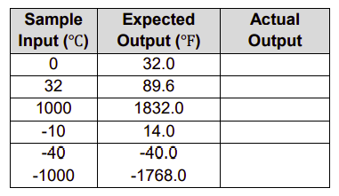

# Temperature Converter

The program below converts degrees Celsius to Fahrenheit. The formula used is:



- The `input` is the degrees Celsius value entered by the user.
- The processing is the conversion (done by applying the formula above)
- The output should be the Fahrenheit value displayed. 

  ## Challenge
1. Ask the user to enter a temerpature in degrees Celsius.
2. Convert the temperture to Fahrenheit.
3. Output the Celsius value entered by the user plus the corresponding Fahrenheit value *(rounded to 1 decimal place).*

````py
Possible Output:

"34 degrees Celsius is equal to 93.2 degrees Fahrenheit."
````

*Hint: Casting the data as a type `float` should make the program more accurate.*

## A note on Testing
The purpose of testing is to verify that the program does what it is meant to. 

It is normal practice for programmers to devise a number of test cases as part of the program design process. Each test case is made up of an input and an expected output. 

When the test case is run the actual output should be recorded. If there is a difference between the expected and actual output, then the program contains an error *(or bug)* 🕷 which will need to be fixed. 

The table below provides a good basis for testing the Celsius to Fahrenheit program you've just created.

## Testing
Enter the following *Sample Inputs* into your program and record and compare the *Expected Output* with your *Actual Output.*



When the program passes all test cases it is said to be unit tested. ✅

A good unit test will ensure that every line of code is triggered. It will also take *‘abnormal’* scenarios into consideration.
