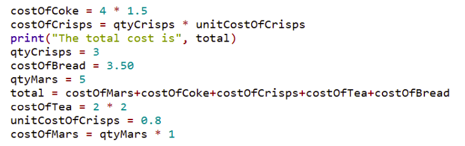
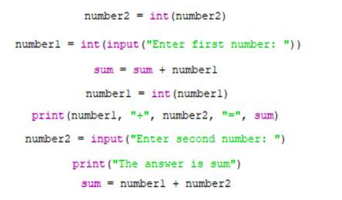

# Parson's Problem 

A Parson’s Problem is a task that involves giving learners all of the lines of code required to solve a problem, but with the lines jumbled so that they are not in the correct order. 

All the necessary code is given to you below. 

However, the code is jumbled up, so you must arrange the lines of code in the correct order to get your program to work.

## Challenge 1
Write a program to calculate and display the `total` from the bill below. 
````
5 x mars bars @ €1 each
4 x cans of coke @ €1.50 each
3 x bags of crisps @ 80 cents each
2 x cups of tea @ €2 euro each
1 x slice pan @ €3.50 each
````
*Hint: Just re-arrange the lines of code shown here:*




````py
# Lines of code to be used

costOfCoke = 4 * 1.5
costOfCrisps = qtyCrisps * unitCostOfCrisps
print("The total cost is", total)
qtyCrisps = 3
costOfBread = 3.50
qtyMars = 5
total = costOfMars + costOfCoke + costOfCrisps + costOfTea + costOfBread
costOfTea = 2 * 2
unitCostOfCrisps = 0.8
costOfMars = qtyMars * 1
````

Please add `# Comments` to your code to explain what each line is doing!


## Challenge 2

Re-arrange the jumbled up lines shown below so that the program displays the `sum` of two integers entered by the end-user. 

*Warning! There are three extra lines that you won’t need.*



Please add `# Comments` to your code to explain what each line is doing!
# 


  