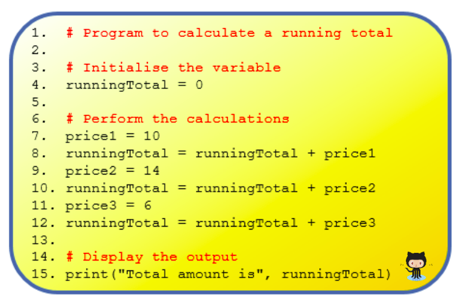
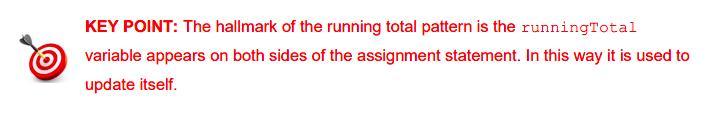

# Running Totals  
Running totals are needed so often in programs that it is well worth putting some effort into understanding the pattern used to create them.

A running total is a value that usually starts at zero and increases by successive additions until a final total is reached. A very common example is a shopping basket total calculated at a checkout. 

Let’s say we have three items in our basket and they are valued at `€10, €14 and €6` respectively. With very little effort, most people understand that the total bill is `€30`. However, what most people probably don’t realise is that they have *(subconsciously)* run a running total program similar to that shown below in their own heads

## Mission 1

In `main.py` code up the program above and see if your value for `runningTotal` is correct.

*Hint: Novice programmers may find the following tips for dealing with running totals useful:*
-  Recognise the need for a running total (this is probably the most difficult step).
-  Initialise your running total variable to zero (line 4 above).
- Every time you need to add a value to the running total use an assignment (lines 8, 10 and 12 above).

Notice the only difference between these lines is the name of the variable being added to runningTotal. 

## Mission 2
Can you re-order the lines in the previous example without 
breaking the code?

## Mission 3

Now see if you can prompt the user to enter values for `price1`, `price2` and `price3` and run the program again, to succesfully calculate `runningTotal`.

# 
 

 

  