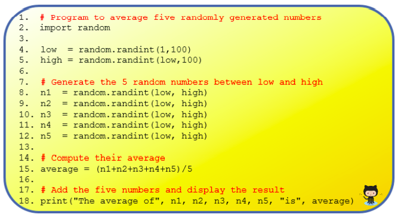
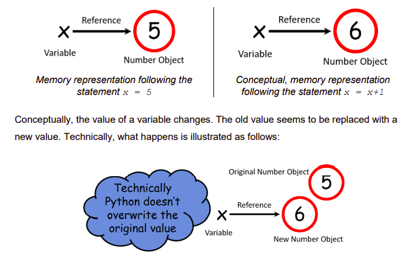

# Introducing Random Numbers 

Random numbers provide a rich way of generating numeric data in early stage 
programming. A more advanced application of random number generation is in games programming.

The following two programs demonstrate random number generation.


- Program 1 - multiplies two randomly generated numbers and displays the result.
- Program 2 - computes the mean of five randomly generated numbers.

## Program 1
Type up the code below in `main.py` and see if you can understand what the lines of code are doing.

````py
# Program to multiply two randomly generated numbers

import random

num1 = random.randint(1,10) # generate a number between 1 and 10
num2 = random.randint(1,10) # generate a number between 1 and 10

# Multiply the two numbers and display the result
print(num1, "times", num2, "=", num1*num2)
````

## Program 2
Type up the code below in `main.py` and see if you can understand what the lines of code are doing.




````py
# Program to average five randomly generated numbers

import random

low  = random.randint(1,100)    
high = random.randint(low,100)

# Generate the 5 random numbers
n1 = random.randint(low, high)
n2 = 

# Compute their average
average = 

# Add the five numbers and display their result
print("")
````


  ## Questions to make you think 🤔
  1. Study both programs carefully - paying particular attention to the comments. Do you undertand what each line is doing?
  2. Explain the purpose of the variables `low` and `high`.
  3. Why do you think the variable `low` is used on line 5?
  4. Explain why the brackets are necessary on line 15.


## Additional Notes
Variables and Memory -

  - When a variable is assigned a value for the very first time it is said to be initialised. We say a variable is initialised to a value. Memory for the variable is allocated at runtime when the variable is initialised.

  - Internally, Python maintains a system table with one entry per variable. The values are represented in memory as objects and a reference links the variable to the object.

The diagrams below illustrate what happens when we initialise the variable `x to 5` and then assign a new value to it.



The old value remains on in memory, and the variable that referenced it before the assignment now references the new value. 

It is for this reason that objects such as strings and numbers are said to be *immutable*. 

Finally, note that the original number object i.e. 5 in this case is left without a reference. 

Unreferenced values are referred to as dangling objects. Such objects are automatically returned by Python, to memory, in a process known as *garbage collection*.


  