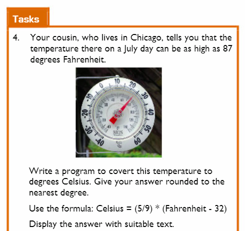

# Task 4 (page 19 of Textbook) 




  ## Steps
  1. ✍ Using the `.draw` file I want you to create a *flow chart* as a template showing how you will answer this problem. 
  2. In `main.py` I want you to prompt the user to enter a temperature value in degrees Fahrenheit (℉).
  3. Use the formula above to convert from ℉ -> ℃.
  4. Use the `round()` function to output your answer to the nearest degree ℃.
  5. Display your answer in degrees celcius (℃) within a suitable sentence.
  
<details>
  <summary> Example 💡</summary>

  *Output:* 
````
 The temperature 89℉ is equal to 32℃.
 ````
</details>


> 

 


  