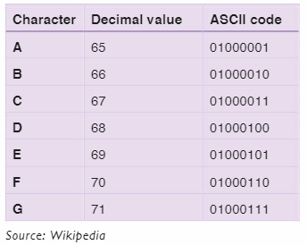

# ASCII 
ASCII was the first character set *(encoding standard)* used between computers on the Internet.

## The ASCII Character Set
ASCII stands for the "American Standard Code for Information Interchange".

It was designed in the early 60's, as a standard character set for computers and electronic devices. 

## 📚 In the beginning... 
Computer data is stored as binary codes `(01000101)` in the electronics.

The binary data is represented by voltage levels inside the computer, called high / low. We can think of these voltage levels as being `on`or `off`, `1` or `0`.

To standardize the storing of text, the American Standard Code for Information Interchange (ASCII) was created. It defined a unique binary number for each storable character to support the numbers from `0-9`, the upper and lower case alphabet `(a-z, A-Z)`, and special characters like `! $ + - ( ) @ < > , `.

- Since ASCII used 7 bits for the character, it could only represent 128 different characters.

- The biggest weakness with ASCII, was that it *excluded* non English letters.

- ASCII is still in use today, especially in large mainframe computer systems.

The character sets used in modern computers, in HTML, and on the Internet, are all based on ASCII.

The following [table](https://www.w3schools.com/charsets/ref_html_ascii.asp) lists the 128 ASCII characters and their equivalent number.

## How ASCII Works 🤓
Each character is represented by a decimal value, which is then converted to a binary code (a sequence of binary digits, called bits.) 

*Eight bits are known as a byte.*

The ASCII code for a character usually consists of one byte.

Here is a sample of some ASCII codes, their corresponding decimal values and characters.

We will discuss ASCII and other codes more in Chapter 7.