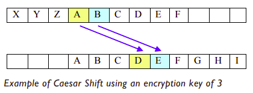

# Encryption Examples 🕵️‍♂️
Encryption is the process of encoding information for 
security purposes.

One basic way of encrypting is to take the ASCII values of 
characters and “shift” each character using something called 
a “key”. 

For example, if a key of +3 were used to encrypt the letter 
A, we would convert A to the appropriate ASCII value and 
then shift this by adding 3 to it. 

This would result in the 
ASCII letter D, because 65+3 = 68. Similarly, the encrypted 
value of C would be F because 67+3 = 70, etc.

## Step 1 - Investigate & Modify
Try the following code in `main.py`
````py
character = "C"
key = 3
ascii=ord(character)
encryptedLetter = chr(ascii + key)
print("The encrypted letter is: ",
encryptedLetter)
````
This type of encryption is known as a *Caesar Shift.* The 
method is named after Julius Caesar who is said to have used 
it to send messages during his military campaigns. It is not 
very secure in practice.



Decrypting a message encrypted with a Ceasar Shift is easy if 
you know the key. If the key was +3, you simply subtract 3 
from each character in the message. 

## Step 2 - Make
👉Try writing some code to encrypt a letter using a different 
key, and then decrypting it using the same shift key.