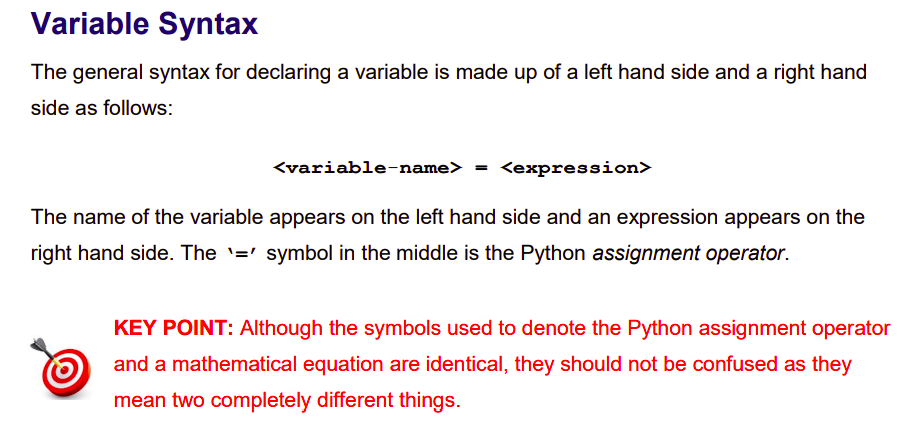
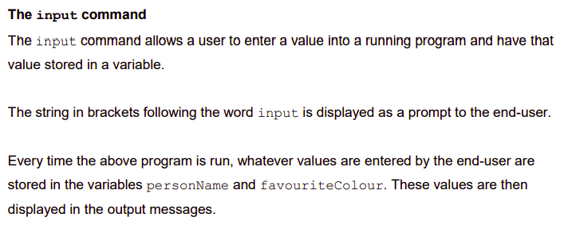

# Variables 

Variables are containers for storing data values.




Python has no command for declaring a variable.
A variable is created the moment you first assign a value to it.

For example, run the following code in ``main.py``:
````python
x = 5
y = "John"
print(x)
print(y)
````
Variables do not need to be declared with any particular type, and can even change type after they have been set.


## Predict
````python
x = 4       # x is of type int
x = "Sally" # x is now of type str
print(x)
````
- What will the programme output when the code above is run in ``main.py``?
- Test your precdiction


## Casting
If you want to specify the data type of a variable, this can be done with casting.
- Try it for yourself in ``main.py``

````python
x = str(3)    # x will be '3'
y = int(3)    # y will be 3
z = float(3)  # z will be 3.0
````


## Get the Type
You can get the data type of a variable with the ``type()`` function.
- Try it for yourself in ``main.py``

````python
x = 5
y = "John"
print(type(x))
print(type(y))
````


## Case-Sensitive
Variable names are case-sensitive.
- Try it for yourself in ``main.py``
````python
a = 4
A = "Sally"
# A will not overwrite a. 
# These are two different variables
````

  ## Tasks
  1. In your copy, *PREDICT* what the following piece of code will output.
````python
# Declaring Variables
personName = "Charlie"
favouriteColour = "Green"
print("Hi", personName, "- your favourite colour is", favouriteColour)
print("Goodbye", personName)
````
Run the code in ``main.py`` to see if your predictions were correct.

  2. Let's see if we can improve upon this programme and make it more dynamic.

Type the following into ``main.py``and run it to see what output you will get.

````python
# Input command
personName = input("Enter your name: ")
favouriteColour = input("Enter your favourite colour: ")
print("Hi", personName, "- your favourite colour is", favouriteColour)
print("Goodbye", personName)
````

Were your predictions correct? Discuss this with your classmates.


## Input Command



  